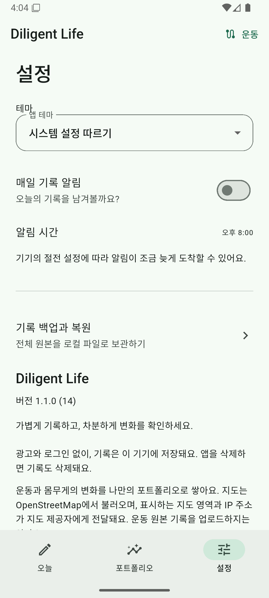
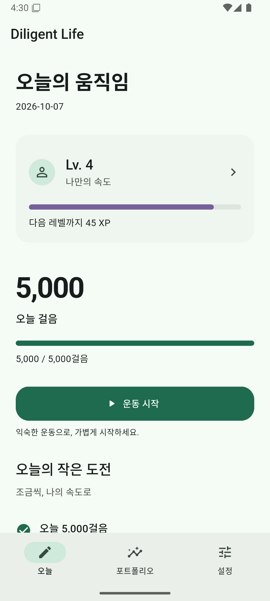
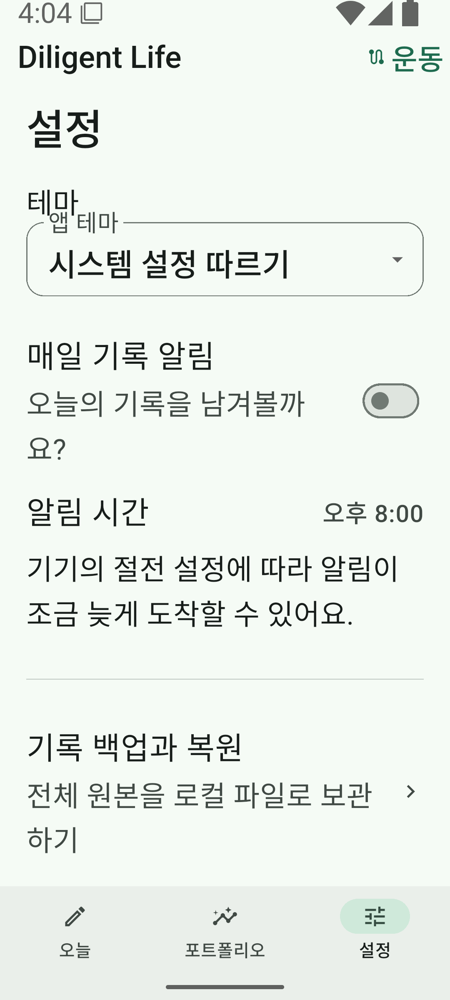
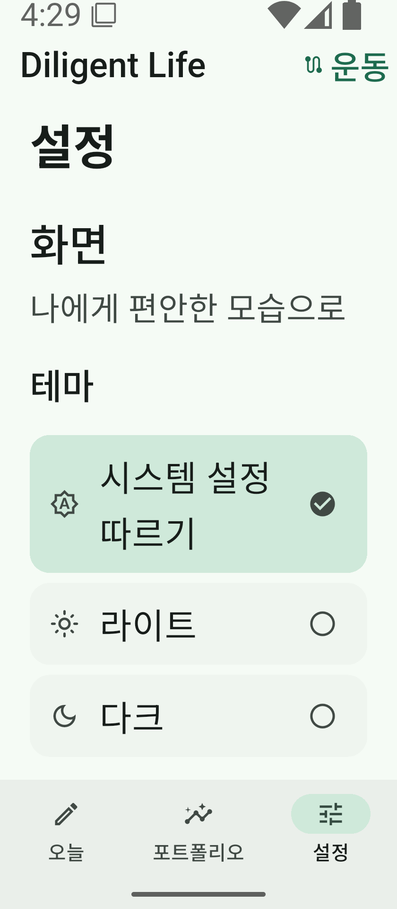

# v1.1 UI polish

기준: 1.1.0(14), `feat/portfolio`의 `02dd448`. 기능·데이터 정책을 유지하고 화면의 정보 순서와 시각적 일관성을 개선한다.

## 화면과 공통 스타일

- 공통 spacing 4/8/12/20/24/32, surface radius 20, control radius 16, 최소 터치 48, CTA 높이 52. section 간 whitespace, 약한 tinted surface, 그림자 없는 카드, sage 활동 강조와 purple XP progress를 사용한다.
- Theme 제목 아래 20dp 간격을 확보한다. control 가용 폭 480dp 이상·기본 글꼴에서는 full-width segmented control, 그 외에는 높이 64dp 이상의 세로 선택을 사용한다. 큰 글꼴은 줄바꿈하며 선택 상태는 배경·check·semantics로 구분한다. 기존 로컬 테마 저장을 사용한다.
- Today: Lv/장착 타이틀/다음 레벨까지 XP → 큰 오늘 걸음/목표 → 운동 시작 → 미완료 우선 일일 퀘스트 최대 2개 → 주간 운동 거리. 성장 로딩·오류에도 운동 시작은 유지한다.
- 성장: 목표와 측정 상태, 최근 7일·주/월 걸음, XP progress, 일일/주간 퀘스트, 업적 잠금/해금, 타이틀 장착 상태를 구분한다. 퀘스트·업적은 아이콘/progress/reward를 함께 표시한다.
- Portfolio: 선택 기간 운동 거리/횟수/시간 → 활동 trend → 같은 기간 일상 걸음 → 체중 → 전체 경로 → 대표/최근 기록 → 리포트. 예상 kcal와 계산 설명은 접힌 집계 안내에서 확인한다. 걸음과 GPS 거리를 더하지 않는다.
- 운동 상세: 지도 → 핵심 통계 → 현재 위치의 거리/시간/페이스 → scrubber/두 handle 선택 → 선택 구간 통계 → 속도 흐름 → 상세 분석. raw GPS·confidence·필터 등 기술 정보는 기존 상세 분석 안에 유지한다.
- Settings: 화면 / 활동 기록 / 데이터 / 앱 정보. 걸음 상태는 화면 진입 시 읽으며 service를 시작하거나 polling하지 않는다. 공유 preview는 테마에 맞는 화면과 일관된 버튼/여백을 사용한다.

## 변경하지 않는 범위

GPS bestForNavigation·약 2초 수집, raw 원본·거리·100m/500m/1km 분석, 기존 화면 OFF/background timer 제어·지도 캐시·저장 transaction, 만보기 native service, XP/보상 ledger 규칙을 변경하지 않는다. schema 4, backup format 2와 이전 백업 호환을 유지한다. dependency·버전 변경은 없다.

Portfolio의 걸음 표시는 기존 `daily_steps`의 날짜/걸음을 선택 기간으로 읽는 조회만 추가한다. 기존 새로고침 경로를 사용하며 새 timer·위치 구독·DB 쓰기를 만들지 않는다. 이미 계산된 분석 결과를 표시하는 scrubber의 구조만 조정한다.

## 검증 기록 — 2026-10-07

- S26 미연결. WHPX 가속의 `Diligent_API36`(Android 16, Google APIs x86_64)을 사용한다. S20은 사용하지 않는다.
- Theme widget: 320/400/600dp × 글꼴 1.0/1.5/2.0 × Light/Dark, 총 18조합에서 제목/control 분리, 선택·설정 복원, Android 터치 크기·접근성 이름·텍스트 대비 검사.
- UI 회귀: 성장 로딩 실패 시 CTA 유지, Today 순서/퀘스트 preview 제한, locked reward 표시, 선택 기간 걸음 집계와 원본 보존, 지도/핵심 통계/scrubber 순서·선택 marker 동기화, Settings 상태 조회가 service를 시작하거나 polling하지 않음을 확인한다.
- `dart format .`, `flutter analyze`, 전체 Flutter 테스트 191개(로컬 비공개 입력 기반 4개 포함), native `:app:stepPolicyChecks` 9개, 정식 서명 release APK 빌드를 검증한다. CI에는 비공개 입력을 제공하지 않으므로 해당 4개는 skip한다.
- 업데이트 설치 전후 emulator synthetic 데이터의 daily record 1개, 운동 3개, route/raw 각 2,703개, 걸음 7일, XP ledger 19개, profile 1개 및 exploration/cursor 테이블 전체 행이 동일하며 schema 4·integrity check가 정상이다. 개인 실사용 데이터는 에뮬레이터에 넣지 않는다.
- Before/after 및 Light/Dark·큰 글꼴 screenshot/XML은 ignored `.tools/emulator-setup-20261007/polish-*`에 보관한다. PR에는 아래 synthetic 화면 비교 이미지만 문서로 포함하고, secret·서명 파일·APK/AAB·개인 데이터·나머지 로컬 검증 산출물은 포함하지 않는다.
- 에뮬레이터에서 Today/Exercise/Portfolio/Settings navigation, 테마와 재시작 유지, 퀘스트·업적·타이틀 장착, scrubber/두 handle, 운동·성취 preview → 시스템 공유창 → 갤러리 저장을 확인했다. 성취 이미지는 720×720, 운동 이미지는 720×900이며 `Pictures/Diligent Life/`에서 확인했다. 실제 작은 화면 320dp·글꼴 2.0에서도 Theme 선택이 겹치지 않는다.
- 실제 scrubber drag의 예: 현재 3.47km/20:48/6:00/km, 선택 구간 2.36km/14:08/10.0km/h/6:00/km. synthetic 원본은 변경하지 않는다.

## 화면 비교

아래 이미지는 모두 에뮬레이터 synthetic 데이터이며 개인 운동 기록이 아니다. Today는 같은 411dp/글꼴 1.0, Theme는 글꼴 2.0으로 변경 전 411dp와 변경 후 더 좁은 320dp를 비교한다. 원본 screenshot은 가공하지 않았다.

| 화면 | 변경 전 | 변경 후 |
| --- | --- | --- |
| Today |  |  |
| Theme 2.0 |  |  |

S26의 실제 걸음 정확도, 장시간 background/화면 OFF 센서, 배터리, 야외 GPS 이동 품질 및 실제 TalkBack 음성 탐색은 실기기 검증 필요다. 에뮬레이터 UI·semantics 결과로 대체하지 않는다.
